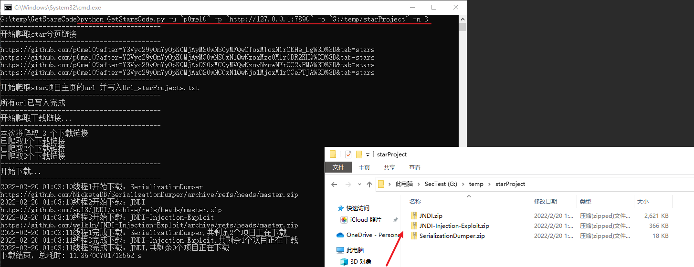

# GetStarsCode

个人学习爬虫写的小项目，主要功能是批量下载github用户stars项目的源码

## 使用说明

```shell
usage: python GetStarsCode.py -u <username> [-p proxy_url] [-o <output_dir>] [-n <maximum_projects>]
    -u : github用户名
    -p : 代理地址
    -o : 下载到本地的目标目录
    -n : 项目的最大下载数量
Example: python GetStarsCode.py -u "p0mel0" -p "http://127.0.0.1:7890" -o "G:\\temp\\starProject" -n 3
```

* GetStarsCode.py作用：爬取用户star项目的所有分页链接，并将star项目的url存本地Url_starProjects.txt
* DownloadByUrls.py作用：请求ProjectUrl_stars.txt中的项目链接，爬取项目源码下载链接并下载

## 效果图


